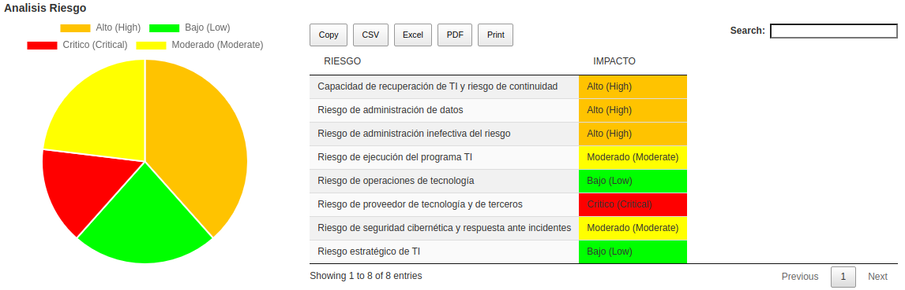
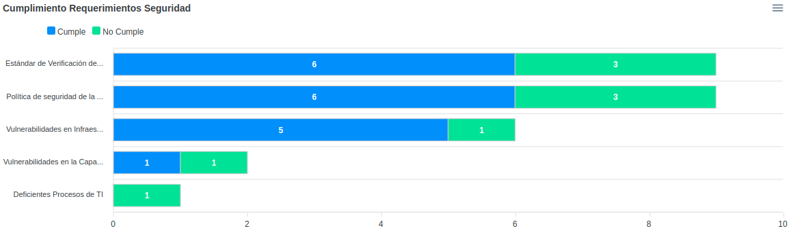
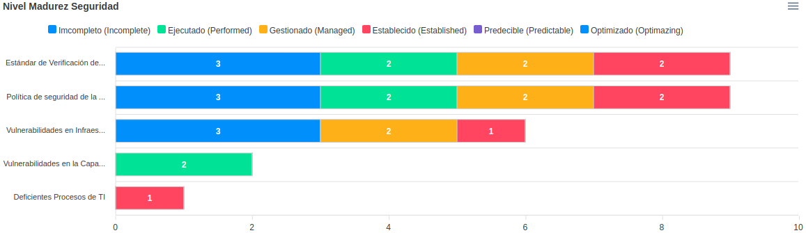

GRCbit - Governance, Risk and Compliance Software (GRC)
Copyright (C) 2020 Rodolfo Lopez
rodolfo.lopez@grcbit.com

GRCbit es un software desarrollado en python/web2py que le ayudará a automatizar y centralizar la gestión de Riesgos TI en su organización (Governance, Risk and Compliance), para tener mayor control sobre sus operaciones, procesos y sistemas críticos.

Está basado en mejores prácticas de gestión de riesgos y control interno como COSO, ISO 31000, COBIT, NIST, CVSS3.1, por lo que cualquier empresa sin importar su tipo o tamaño puede utilizarlo, lo cual traerá beneficios como: Cumplir con leyes y regulaciones, Reducir fraudes, Reducir de errores en la operación, Proteger datos críticos y sistemas de información.

Demo: www.grcbit.com

